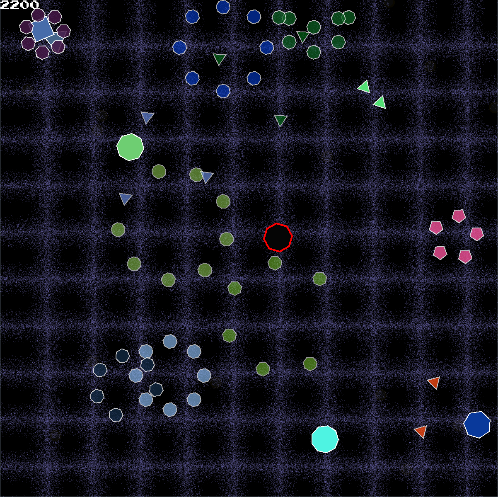

# Assignment Two - Geometry Wars

## Config File

### Default

```txt
Window 1280 720 60 0
Font arial.ttf 24 255 255 255
Player 32 32 5 5 5 5 255 0 0 4 8
Enemy 32 32 3 3 255 255 255 2 3 8 90 120
Bullet 10 10 20 255 255 255 255 255 255 4 2 20 90
```

### Window W H FL FS

This line declares that the SFML Window must be constructed.

```txt
Window Width            W               int
Window Height           H               int
FrameLimit              FL              int
FullScreen              FS              int
```

### Font F S R G B

This lines defines the font which is to be used to draw text for this program.
The format of the line is as follows:

```txt
Font File               F               std::string
Font Size               S               int
RGB Color               R, G, B         int, int, int
```

### Player SR CR S FR FG FB OR OG OB OT V

Defines a Player with:

```txt
Shape Radius            SR              int
Collision Radius        CR              int
Speed                   S               float
Fill Color              FR,FG,FB        int,int,int
Outline Color           OR,OG,OB        int,int,int
Outline Thickness       OT              int
Shape Vertices          V               int
```


### Enemy SR CR SMIN SMAX OR OG OB OT VMIN VMAX L SI

Defines a Enemy with:

```txt
Shape Radius            SR              int
Collision Radius        CR              int
Min/Max Speed           SMIN,SMAX       float,float
Outline Color           OR,OG,OB        int,int,int
Outline Thickness       OT              int
Min/Max Vertices        VMIN,VMAX       int,int
Small LifeSpan          L               int
Spawn Interval          SP              int
```

### Bullet SR CR S FR FG FB OR OG OB OT V L

Defines a Bullet with:

```txt
Shape Radius            SR              int
Collision Radius        CR              int
Speed                   S               float
Fill Color              FR,FG,FB        int,int,int
Outline Color           OR,OG,OB        int,int,int
Outline Thickness       OT              int
Shape Vertices          V               int
LifeSpan                L               int
Special Bullet Amount   SB              int
```

## Screenshot


