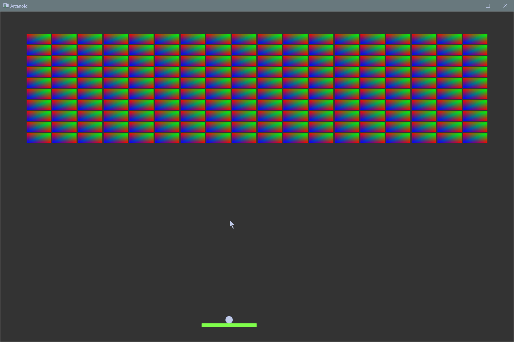

# OpenGL version on Arkanoid

## You need to get one of OpenGL libraries

- Main library is [freeglut](http://freeglut.sourceforge.net/) and version for [windows](http://www.transmissionzero.co.uk/software/freeglut-devel/)
- You can use original [GLUT](https://www.opengl.org/resources/libraries/glut/) library, but it is not open source. [Mark Kilgard](https://en.wikipedia.org/wiki/Mark_Kilgard) maintains the copyright. And if you're going to use glut toolkit, you need to change header file from **"GL/freeglut.h"** to **"GL/glut.h"**

## Screenshot

